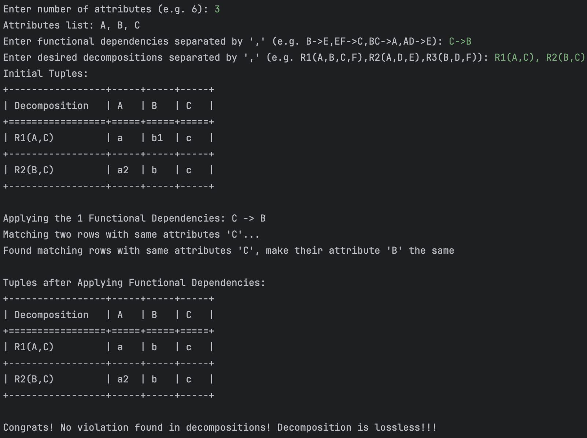

# Visualize-Chase-Algorithm-in-Python


## Update on 2024/04/01
### Chase with Distinguished Variables
#### Definition


#### Implementation
```commandline
chase_with_distinguished_variables.py
```


## Update on 2024/03/30
### Simple Chase
#### Definition
Given R, a set of functional/multi-value dependencies
Check if desired dependency can be fulfilled

#### Implementation
```commandline
simple_chase.py
```

Example 1: 4 A->>B,C;D->C A->C


Example 2: 4 A->>B;B->>C A->>C


## Update on 2024/03/22
### Chase checking lossless decomposition
#### Definition
Given R, a set of functional dependencies only (no mvd)
Check if desired decomposition is lossless

#### Implementation
```commandline
chase_checking_lossless_decomposition.py
chase_checking_lossless_decomposition_GUI.py
```

Example 1: 3 C->B R1(A,C), R2(B,C)


Example 2: 6 B->E,EF->C,BC->A,AD->E R1(A,B,C,F),R2(A,D,E),R3(B,D,F)


Example 3: 3 A->C R1(A,B),R2(B,C)


GUI version by Yijia


